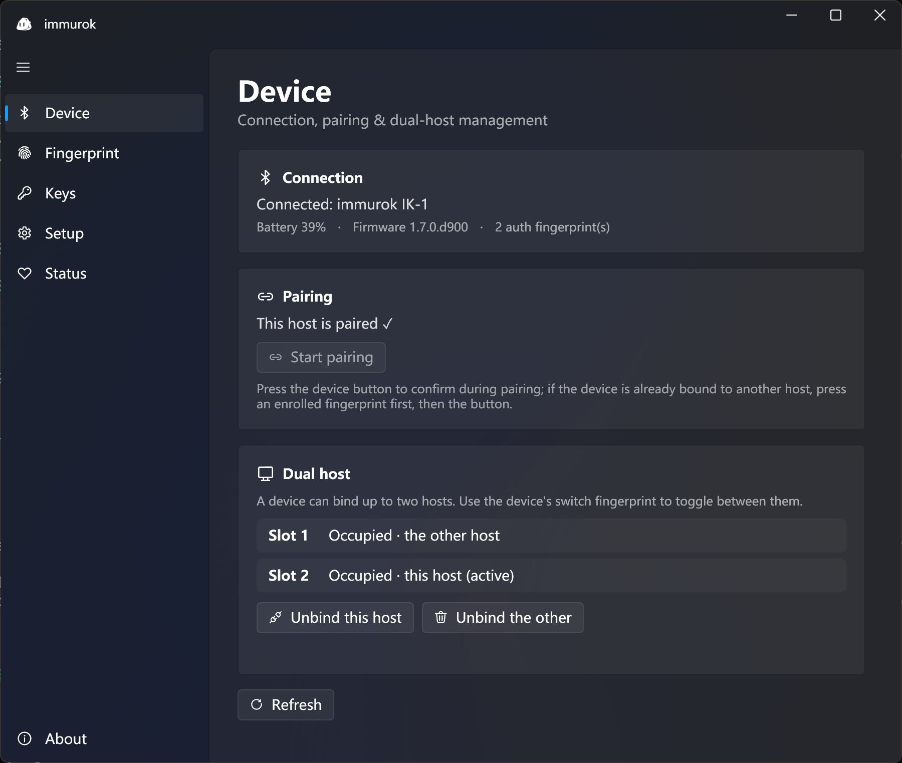

# immurok · Windows

Windows client for the immurok Bluetooth fingerprint authentication system. Paired with a CH592F + R559S fingerprint device, it brings a Windows Hello–like experience to Windows:

- **Lock-screen / logon unlock** — sign in with a fingerprint touch, via a Credential Provider
- **SSH / git signing** — built-in SSH agent that signs with keys stored on the device (authorized by fingerprint)
- **TOTP / key management** — OTP secrets and SSH keys kept on the device
- **OTA firmware updates** — update device firmware over the air

For the macOS client see [`app-macos`](https://github.com/immurok/app-macos); both share the same BLE GATT protocol and firmware.

## Screenshot



## Components

| Project | Language | Description |
|---------|----------|-------------|
| `ImmurokCommon` | C# (.NET 8) | Shared library: GATT UUIDs, command/status enums, IPC text protocol and framing |
| `ImmurokService` | C# (.NET 8) | Windows service: BLE communication, ECDH+HKDF+HMAC security layer, named-pipe IPC, lock-screen unlock, SSH agent, OTA |
| `ImmurokClient` | C# (WPF + Fluent) | Desktop client: pairing, fingerprint enrollment, key management, device status and settings |
| `ImmurokCli` | C# (.NET 8) | Command-line client, over the same IPC pipe |
| `ImmurokCredentialProvider` | C++ (COM DLL) | Credential Provider that runs inside LogonUI and submits credentials on the lock screen |
| `ImmurokConsolePrompt` | C# | Console prompt for SSH / terminal authorization |

## Build

Requires **Visual Studio 2022** (with the "Desktop development with C++" workload and the .NET 8 SDK).

```powershell
# Build everything (.NET components + C++ Credential Provider)
./build.ps1 -Configuration Release

# Or open immurok-win.sln in Visual Studio and build (x64)
```

## Install / Uninstall

Requires administrator privileges. **A crashing Credential Provider can lock you out of Windows — always validate it first in a snapshotted, rollback-capable virtual machine.**

```powershell
./install.ps1 -Configuration Release
./uninstall.ps1
```

## Documentation

- **[IMPLEMENTATION_PLAN.md](./IMPLEMENTATION_PLAN.md)** — full architecture and implementation notes (protocol constants, security design, unlock mechanism)
- **[TROUBLESHOOTING.md](./TROUBLESHOOTING.md)** — field notes for real-device issues (SSH agent, BLE connection, OTA, etc.)

## Status

**Current version: 0.1.0-alpha.** An early preview — interfaces and protocols may change, and it is not yet recommended for production use. The BLE stack, security layer, and IPC are functional at their core; the Credential Provider and client UI are still being refined. See IMPLEMENTATION_PLAN.md for details.

## Acknowledgments

- [Microsoft Credential Provider sample](https://github.com/microsoft/Windows-classic-samples/tree/main/Samples/CredentialProvider) (MIT) — the basis for `ImmurokCredentialProvider`
- [BLEUnlock](https://github.com/ts1/BLEUnlock) — reference for the BLE-proximity unlock approach

Key third-party libraries:

- [WPF-UI](https://github.com/lepoco/wpfui) — Fluent-style client UI
- [CommunityToolkit.Mvvm](https://github.com/CommunityToolkit/dotnet) — MVVM support
- [H.NotifyIcon](https://github.com/HavenDV/H.NotifyIcon) — tray icon
- [BouncyCastle](https://github.com/bcgit/bc-csharp) — cryptographic primitives
- [Serilog](https://serilog.net) — logging

## License

Licensed under the [Apache License 2.0](./LICENSE).

Most of the C++ Credential Provider (`CSampleProvider`, `CSampleCredential`, `Dll`, `helpers`, `common.h`) is derived from Microsoft's official Credential Provider sample (MIT-licensed) and retains its original copyright headers; `CPipeListener.{cpp,h}` is original immurok code under Apache 2.0. Full third-party attributions, including the MIT license text and NuGet dependency licenses, are in [THIRD_PARTY_NOTICES.md](./THIRD_PARTY_NOTICES.md).
