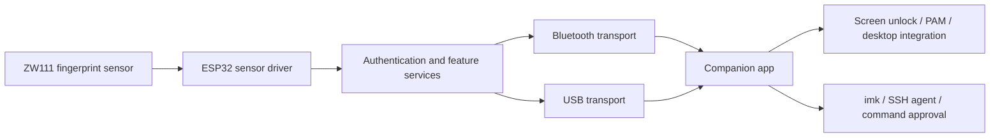

# Folder analysis: reusing immurok on ESP32-S3 + ZW111

Reviewed 2026-10-07 against the consolidated source at `b5b448f`. Target: Seeed XIAO ESP32-S3, ZW111, USB data and Bluetooth, initially on this Mac. This is a source review and implementation plan, not completed feature parity or a security audit.

Use the [feature parity checklist](FEATURE_CHECKLIST.md) for implementation order and evidence-backed completion tracking. Its [upstream inventory](upstream-feature-sources.json) also covers the website, organization profile and archived Linux implementation.

## The idea behind the system

The sensor stores and matches fingerprint templates locally. Firmware controls enrollment, pairing, host selection, authenticated events, and access to device-held keys and secrets. A companion app receives those events and integrates with the operating system: screen unlock, privilege prompts, SSH, password managers, and command approval. The `imk` CLI is a client of that companion app; it is not a separate sensor driver.

Consequently, most desktop features can survive a chip change. The boundary we must implement is the device protocol, its authorization behavior, and its storage model.

USB and BLE should share command dispatch and authorization rules. Explicit transport selection and one credential-output path per operation prevent the old helper, device HID, and new app from typing the same password twice.

## Top-level folder map

| Folder | Purpose | ESP32 reuse decision |
| --- | --- | --- |
| [`firmware`](../firmware) | Device logic, CH592F platform code, and our imported ESP32 baseline | Keep portable policies and feature semantics; implement platform services with ESP-IDF |
| [`app-macos`](../app-macos) | Native Mac app, CLI, SSH agent, PAM, local approval and input injection | Primary companion to adapt first; add capabilities and USB transport |
| [`app-win`](../app-win) | Windows UI, background service, CLI and login Credential Provider | Reuse Windows integration after device protocol works; test on Windows |
| [`app-linux-rs`](../app-linux-rs) | Linux daemon, GUI, CLI, session bridge and PAM | Reuse Linux architecture; add transport support and test on Linux |
| [`ota`](../ota) | Firmware packaging, update transport, CH592F boot/copy code | Reuse package concepts and UI; replace bootloader, flash layout and upload backend |
| [`hardware`](../hardware) | CH592F + R559S circuit documentation and PCB images | Functional reference for a future board; not an ESP32 pin map |
| [`docs`](.) | Protocol, security, application and system descriptions | Starting specifications; reconcile with actual code and document ESP32 extensions |
| [`imk-skill`](../imk-skill) | Agent instructions and plugin metadata for `imk` | Reuse once the CLI and approval backend work; no firmware changes required here |

## 1. Firmware

### Subfolders and responsibilities

| Path | What it does | What to carry forward |
| --- | --- | --- |
| `APP/main.c`, `APP/hidkbd.c` | CH592F startup and central BLE/command/fingerprint state machine | Command semantics and state transitions; replace WCH/TMOS scheduling with ESP-IDF tasks and queues |
| `APP/fingerprint.c` | R559S UART operations and sensor power control | Enrollment/match behavior as a reference; use our working ZW111 driver |
| `APP/immurok_security.c` | Pairing, shared keys, challenge responses and event authentication | Wire format and authorization intent; use ESP32 randomness and a tested crypto backend |
| `APP/immurok_slots.c`, `APP/slot_meta.c`, `APP/immurok_snv.c` | Two host slots, peer metadata and isolated persistence | Host selection and isolation; replace CH592F flash addresses with ESP32 storage |
| `APP/immurok_keystore.c` | SSH, OTP and API-secret records and storage operations | Feature API and record semantics; design encrypted persistent storage for ESP32 |
| `APP/include/fp_policy.h`, `pair_policy.h` | Fingerprint deletion/enrollment and host-pairing rules | Portable logic, adapted to our logical fingerprint IDs |
| `APP/totp_core.c` | SHA-1 TOTP generation | Reuse with known-answer tests and explicit time/secret encoding rules |
| `Profile` | WCH GATT services, HID and related profiles | Service/characteristic contract; implement using NimBLE |
| `LIB` | Cryptographic helpers and platform dependencies | Check each dependency; retain test vectors when moving crypto to ESP-IDF libraries |
| `Ld`, `Startup`, root Makefiles | WCH RISC-V linking, startup and build | Keep for upstream reference; ESP32-S3 uses its own Xtensa/ESP-IDF build |
| `test` | Host-side tests using fake EEPROM | Reuse as regression tests for portable behavior |
| `tools/devtest` | Device integration tests and maintenance commands | Adapt discovery and protocol; review destructive/reset stages before running |
| `ports/esp32s3` | Existing tinyTouch ESP-IDF firmware baseline | The starting point for our port; independently build before changing the installed prototype |

### Sensor differences

The upstream fingerprint implementation uses six visible slots, including a switch fingerprint, and an R559S enrollment sequence. Our baseline defines ten logical profiles with four template views each and a forty-template limit in [`finger_profiles.h`](../firmware/ports/esp32s3/main/finger_profiles.h). These are software assumptions, not a fresh measurement of the attached sensor's capacity.

We need a logical fingerprint layer that reports actual supported slots and enrollment steps. Do not copy R559S page IDs, score thresholds or capture counts into the ZW111 driver. Preserve the current enrolled template and ownership data during development. A migration must explicitly translate existing IDs; re-enrollment should be a deliberate user action.

### Storage and scheduling differences

CH592F EEPROM addresses and interrupt-masking sequences cannot be reused on ESP32. The upstream keystore implementation performs raw record/block writes; this review did not establish encryption of all vault records at rest. The README's encrypted-vault claim is insufficient evidence for an ESP32 storage design. Define encryption, key lifecycle, atomic updates and deletion behavior explicitly.

The shared scratch buffers used by some firmware routines also need serialization or separate buffers under FreeRTOS. Preserve host-slot isolation and the policy that a switch-only fingerprint cannot leave the owner without an authentication finger.

## 2. macOS app

This is the best first integration target because we can test it on the current machine.

| Path | Responsibility | Port work |
| --- | --- | --- |
| `Sources/immurokApp.swift`, `ContentView.swift`, `AppViewModel.swift`, setup/settings views | Menu-bar app and user interface | Reuse; introduce tinyTouch identity and device capabilities |
| `Sources/BLEManager.swift` | CoreBluetooth discovery, command exchange, pairing and reconnect | Implement compatible ESP32 services; extract a transport interface for USB |
| `Sources/ImmurokSecurity.swift` | CryptoKit pairing, verification and Keychain storage | Match byte order/KDF exactly; migrate identity and Keychain access deliberately |
| `Sources/AppDelegate.swift`, `AuthInjector.swift`, `AuthContextDetector.swift` | Route matches to lock screen, pending prompts or a supported focused field | Reuse routing/injection after authenticated device integration |
| `AuthInjectionKit` | Input/context decision logic | Reuse and retain its tests |
| `Sources/SSHAgentServer.swift` | SSH-agent protocol and device signing requests | Reuse after ESP32 implements generation, public-key lookup and signing |
| `CLISources`, `CLISocketServer.swift`, `PAMSocketServer.swift`, `pam` | CLI, local IPC and sudo/PAM bridge | Preserve peer checks and approval behavior; test before installing PAM |
| `FirmwareUpdateKit`, update views/services | Package validation, transfer and progress | Replace CH592F size/layout assumptions with a negotiated ESP32 updater |
| `Resources`, `packaging`, build scripts, `Tests` | Localization, assets, deployment and regression tests | Update release/signing metadata; preserve notices and migrate existing configuration |

The fingerprint UI uses firmware-version checks, a six-capture enrollment assumption and a small slot bitmap. Our version `0.1.35` is not comparable to immurok's version line. Add explicit capabilities instead of pretending to be a newer upstream firmware.

The OTA parser allows only 216 KB and the transfer engine assumes 54 erase blocks. Our ESP32 image exceeds that allowance. Changing the advertised device name or UUID will not fix this.

The app normally reads a locally stored password and injects it through macOS APIs. Our working tinyTouch path can instead send an encrypted credential to device HID. We must choose the output owner per operation and preserve existing Keychain access during migration. Accessibility permission and lock-screen behavior require separate functional tests.

## 3. Windows app

| Project/folder | Responsibility | Reuse boundary |
| --- | --- | --- |
| `ImmurokCommon` | Shared protocol constants, models and IPC contracts | Reuse with a common protocol/capability specification |
| `ImmurokService` | BLE/security, authenticated IPC, SSH, OTA and session coordination | Adapt device/USB transport; retain Windows session and pipe trust checks |
| `ImmurokClient` | WPF interface | Reuse settings and management views with ESP32 capabilities |
| `ImmurokCli` | Command-line client | Reuse once service commands are compatible |
| `ImmurokConsolePrompt` | Interactive authorization prompt | Reuse local approval flow |
| `ImmurokCredentialProvider` | Native C++ login integration | Reuse platform integration; validate in a recoverable Windows test environment |
| `packaging`, `tools`, scripts, `docs` | Installer, build and deployment material | Adjust monorepo/release paths and tinyTouch identity |

`ScreenUnlocker` checks the Credential Provider pipe's owner, process and session before supplying credentials; preserve those checks. Compare client commands with current firmware, rather than treating every stale symbol as a missing feature: slot PIN commands `0x3A`/`0x3B` were retired in favor of fingerprint plus button registration. Upstream Windows describes an early preview, so copying its source does not establish complete feature parity. Compilation and login behavior must be verified on Windows.

## 4. Linux app

The Rust workspace has six crates:

| Crate | Responsibility |
| --- | --- |
| `immurok-common` | Protocol, security, paths and IPC definitions |
| `immurok-daemon` | BLE connection, device coordination, SSH, OTA, sockets and power/session handling |
| `immurok-client` | Shared client access to the daemon |
| `immurok-cli` | Terminal commands and management |
| `immurok-gui` | GTK4/libadwaita desktop interface |
| `immurok-session-agent` | Bridge between system service and desktop user session |

`pam` supplies the C authentication module; `packaging` contains service, polkit, D-Bus and distribution integration; `scripts` includes BLE helpers. Reuse the separation between privileged service and user session. Update discovery/name assumptions and protocol helpers together. Add a USB backend and appropriate device-access rules. Test suspend/reconnect, socket permissions, PAM fallback and desktop unlock on Linux; a Mac source review cannot verify those behaviors.

## 5. OTA

`jumpapp` and `iap` implement CH592F boot/copy behavior. Their addresses, startup assembly and flash operations are unsuitable for ESP32-S3. Flashing scripts using WCH tools likewise need an ESP32 backend.

[`ota-package.py`](../ota/ota-package.py) supports a v2 package with hardware/security metadata, an ECDSA signature and AES-CTR payload encryption. Some older prose describes the legacy HMAC format. Use current source and package tests when defining compatibility.

Reuse the package-validation concepts and companion update UI. On ESP32, write the inactive application partition through ESP-IDF OTA APIs, validate the image and board identity, then implement boot confirmation and rollback. Negotiate capacity and transfer limits instead of inheriting the CH592F layout. The currently installed development firmware does not establish a production secure-boot or signed-OTA chain.

`ota-update.py` delegates to the local app; release/deploy scripts and `web/README.md` describe distribution. They must reference this repository and ESP32 artifacts before releases become usable.

## 6. Hardware

`schematic/SCH7.pdf`, PCB top/bottom images and the README describe CH592F + R559S. This folder does not currently supply editable PCB source. Treat power regulation, charging, sensor power switching and enclosure arrangement as references, not validated wiring for our board. This analysis did not perform a circuit-level audit of the PDF.

Our established sensor mapping remains VTouch and VCC to 3V3, TouchOut to D1/GPIO2, sensor TX to D7/GPIO44, sensor RX to D6/GPIO43, and GND to GND. Retain USB data capability in a future board. Battery telemetry requires a suitable ADC circuit; the current baseline's constant battery percentage is not a measured charge level. Sensor power gating, additional buttons and tamper functions require hardware that is not yet installed.

## 7. Documentation and agent integration

`docs/protocol.md`, `security.md`, `app-spec.md` and `description.md` explain the intended system. They are useful requirements inputs, but version-dependent details must be checked against implementation. Keep ESP32-specific behavior separate from upstream hardware claims.

`imk-skill` contains `skills/using-imk/SKILL.md`, agent convention files and plugin metadata. It teaches agents to request visible approval through `imk run --agent`, and to honor rejection and timeout. We can reuse the workflow after the companion, CLI and fingerprint-gated operations work. Reviewing these instructions does not install or activate the integration.

## Compatibility issues to resolve first

1. **Protocol:** our baseline uses Nordic UART UUIDs and text `EV`/`EV2` frames; immurok uses custom GATT services and binary command frames. Implement commands and state transitions, not just renamed UUIDs.
2. **Freshness:** [`verifyFingerprintMatch`](../app-macos/Sources/ImmurokSecurity.swift) authenticates an event containing its type and page ID, without an application-level nonce/counter. BLE encryption has its own protections; this is not a demonstrated attack. For the port, bind authenticated events to a session and sequence/request so our existing replay protections are preserved. Update all clients together.
3. **Capabilities:** negotiate logical slots, enrollment progress, supported commands, transport modes, battery telemetry and OTA limits. Unsupported features should be unavailable in the UI.
4. **Ownership and requests:** keep separate host keys/bonds, explicit pairing approval, and authorized switching. Bind sensitive operations to the intended host, operation and expiry; define any authorization reuse window explicitly.
5. **Vault and crypto:** verify P-256 encoding/KDF across C, Swift, C# and Rust. Design encrypted persistence before enabling API-secret or private-key storage.
6. **Monorepo releases:** nested component `.github/workflows` are not root GitHub Actions workflows. Consolidate CI with component working directories and create distinct app/firmware artifacts. Retain each component's license and attribution.

## Implementation sequence and evidence required

| Stage | Deliverable | Acceptance evidence |
| --- | --- | --- |
| 1 | Independently build the imported ESP32 baseline | Successful ESP-IDF build and recoverable local backup; existing enrollment retained |
| 2 | Shared protocol/capabilities and Mac pairing/status/enrollment | Cross-language fixtures, wrong-host rejection, replay rejection and sensor mapping tests |
| 3 | Native Mac unlock over BLE and USB | One output per touch; locked/unlocked screen, battery startup and reconnect tests |
| 4 | Host switching, SSH and privilege approval | Separate host credentials, signing interoperability, rejection/timeout and fallback-password tests |
| 5 | OTP/API vault, app unlock and agent integration | RFC vectors, storage lifecycle, approved target selection and exact-command approval tests |
| 6 | Windows/Linux companions and ESP32 OTA/power work | Target-OS login tests; invalid-image rejection, interruption/rollback and measured power behavior |

Start with stages 1–3 on this Mac. They establish the device boundary needed by the other applications without requiring direct soldering to proceed with software development.

## Verification performed in this review

Ran `make` in `firmware/test` on this Mac. All ten host test executables passed: smoke/fake EEPROM, slots, slot metadata, SNV, tick conversion, fingerprint policy, SHA-256/HMAC, RNG, pairing policy and SHA-1/TOTP. These tests validate existing portable logic and simulated storage, not ESP32 peripherals, production randomness, encrypted vault storage or live authentication.

No firmware was flashed, companion app installed, PAM/login configuration changed, or Windows/Linux runtime tested during this review. The imported ESP32 baseline still requires its independent build and device acceptance tests.
